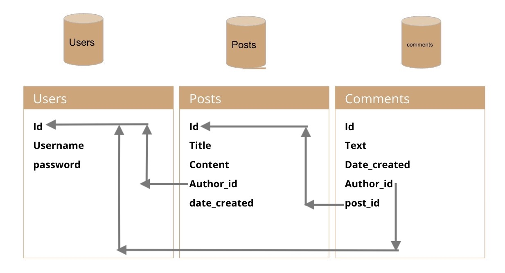

# The MVC-Tech-Blog

  ## Description 
  The purpose of this application was to built a full stack application using the Model-View-Controller (MVC) along with the corresponding technologies such as express-handlebars, dontenv, bcrypt, express-sessions, and a connect-session-sequelize. Bringing these technologies I created a Tech-Blog app, which allows the user to post blog posts and comment to other developers in the industry. Users can create accounts, edit and delete their posts and have the interaction of blog app at their convenience. 

  This application is using Express.js API in conjunction with Sequelize to access with a MySQL database for the full back end support for any E-Commerce website. 
  

  ## Table of Contents
  - [Installation](#installation)
  - [Usage](#usage)
  - [Credits](#credits)
  - [License](#license)
  - [Features](#features)
  - [How To Contribute](#how-to-contribute)
  - [Author](#author)
  - [Test](#test)
  - [Live Site](#live-site)
  - [Screenshots](#screenshots)

  ## Installation 
  In order to run this backend application you will have to have all the source files and database for full functional support and exploration of this app. 

  ## Usage
  To run this application you need to run this:


```
npm i

npm run seed

npm start
```
    
  ## Credits
  List your collaborators, if any, with links to their GitHub profiles.

  Karen Peazzoni: https://github.com/kpeazzoni \
  Josh Goeke: https://github.com/joshuagoeke \
  Myeonghun Jeong: https://github.com/mjtic \
  Rebecca Girndt: <https://github.com/Re-Gi> 

  And of course but not in the very least UTA Tutors: Meg Meyers!

  ## License 
  MIT License
  
  [](https://choosealicense.com/licenses/mit-license/.)
  
Copyright (c) [2023] [The MVC Tech Blog App]

Permission is hereby granted, free of charge, to any person obtaining a copy
of this software and associated documentation files (the "Software"), to deal
in the Software without restriction, including without limitation the rights
to use, copy, modify, merge, publish, distribute, sublicense, and/or sell
copies of the Software, and to permit persons to whom the Software is
furnished to do so, subject to the following conditions:

The above copyright notice and this permission notice shall be included in all
copies or substantial portions of the Software.

THE SOFTWARE IS PROVIDED "AS IS", WITHOUT WARRANTY OF ANY KIND, EXPRESS OR
IMPLIED, INCLUDING BUT NOT LIMITED TO THE WARRANTIES OF MERCHANTABILITY,
FITNESS FOR A PARTICULAR PURPOSE AND NONINFRINGEMENT. IN NO EVENT SHALL THE
AUTHORS OR COPYRIGHT HOLDERS BE LIABLE FOR ANY CLAIM, DAMAGES OR OTHER
LIABILITY, WHETHER IN AN ACTION OF CONTRACT, TORT OR OTHERWISE, ARISING FROM,
OUT OF OR IN CONNECTION WITH THE SOFTWARE OR THE USE OR OTHER DEALINGS IN THE
SOFTWARE.
  
  ## Features
  The features of this application is to provide a full functional back end application capable of support an blog posting site. At the moment there is no front end development or website to explore the user experience. In future iterations that would be planned for further development. I am hosting this on Heroku website for presentation. 

  ## How to Contribute
  You can contribute to the project by email me at: frappejcat@gmail.com

  ## Author 
  Christopher Zavala:
  https://github.com/chriszavala

  ## Test
 The user can test the functicallity of this application for their use. Please report any issues or bugs to make this an even better user experience.  

 ## Live Site
  [Click to see the live site](https://polar-castle-47001.herokuapp.com/)

  ## Screenshots:



.jpg)


